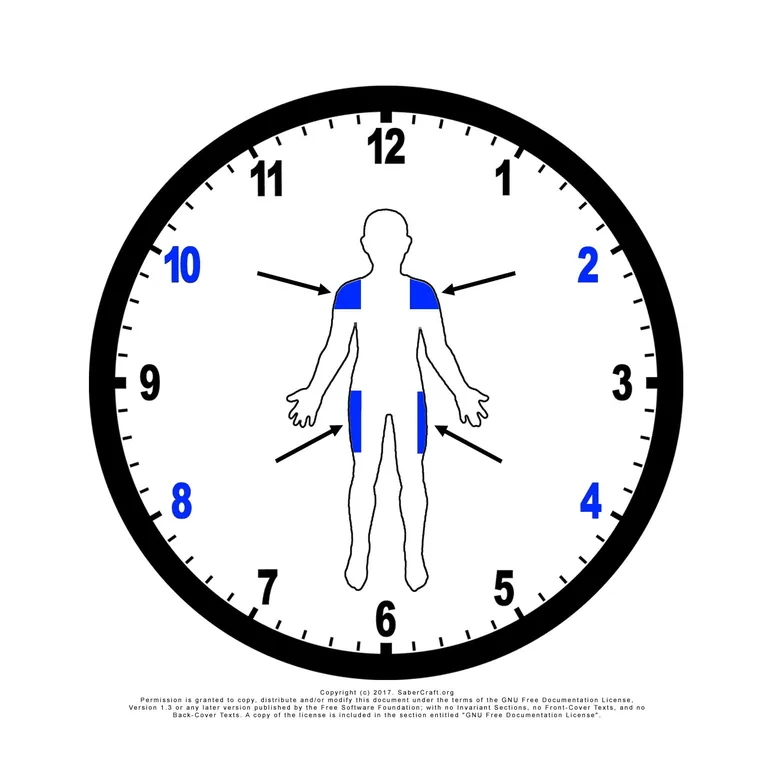

# CM-B

  <iframe src="https://www.youtube.com/embed/fFMvmpVAlgU" title="CM-B demonstration" style="position:absolute;top:0;left:0;width:100%;height:100%;border:0;" allowfullscreen></iframe>

[{ width="200" }](../assets/images/notation/targets-overview-2.webp){ .diagram-zoom target="_blank" rel="noopener" title="View the 2nd four targets full size" }

CM-B is the second core movement in the Saber Standard: **angle attacks on targets 2, 10, 4, and 8**.

Where [CM-A](cm-a.md) works the upright lines, CM-B moves the exchange into the corners — the shoulder and hip angles.

The diagram shows those four points highlighted. Select it to open it full size in a new tab.

## Notation

| Player | Step 1 | Step 2 | Step 3 | Step 4 | Step 5 | Step 6 | Step 7 | Step 8 |
|---|---:|---:|---:|---:|---:|---:|---:|---:|
| Saberist A | 2 | 10 | 4 | 8 | 2 | 10 | 4 | 8 |
| Saberist B | 2P | 10P | 4P | 8P | 2P | 10P | 4P | 8P |

The four angle points run twice. Steps 5 through 8 repeat steps 1 through 4 exactly.

## Telegraph

**Palm pointed out at your opponent, all fingers pointing up (ASL-B).**

The telegraph is the silent signal that calls CM-B before an exchange begins. See [LUMINA Games](../games/index.md) for how telegraphs are used in play.

## The four angle points

CM-A introduces six target lines. CM-B adds four more:

| Target | Corner | Angle |
|---:|---|---|
| `2` | Upper corner | Shoulder-height angle |
| `10` | Opposite upper corner | Shoulder-height angle |
| `4` | Lower corner | Hip-height angle |
| `8` | Opposite lower corner | Hip-height angle |

These four points are the whole of CM-B — every step in the movement lands on one of them.

They are also what completes the Saber Standard target model. With the corners in play, a Saberist can write and read a diagonal exchange in the same notation used for a vertical or horizontal one, and choreography no longer has to be described in words when it leaves the upright lines. That is the practical reason the angle points matter: they make the notation cover the full clock face rather than a subset of it.

## Purpose

CM-B is designed to teach:

- the four angle target lines
- diagonal attack and parry pairing
- the corner-to-corner rhythm of upper and lower angles
- a repeating eight-step sequence
- angle recovery between shoulder and hip height
- role awareness between Saberist A and Saberist B

Like CM-A, CM-B is a foundation drill rather than a performance sequence.

## Training method

### Phase 1: Static walkthrough

Move one step at a time.

After each step, pause and confirm:

- both Saberists know which corner is being attacked
- the parry matches the angle, not just the height
- distance is safe
- the movement can be repeated

The two upper angles and the two lower angles are easy to confuse early on. Name the target out loud until the corners are obvious to both Saberists.

### Phase 2: Slow continuous flow

Perform all eight steps without stopping.

Keep the movement slow enough that both Saberists can read every line. The transition from step 4 back into step 5 — lower corner returning to upper corner — is where the sequence most often breaks. Practice that seam on its own if needed.

If either Saberist loses the sequence, stop and restart from Step 1.

### Phase 3: Role switch

Switch roles.

Now Saberist B performs the attack row and Saberist A performs the parry row.

Both Saberists should learn both sides of CM-B.

## Teaching note

CM-B should be taught as a language drill, not as a fight.

Angle attacks travel further than upright ones, so distance discipline matters more here than in CM-A. Reset the pair rather than letting a wide angle close the gap.

Once CM-B is clean, both Saberists have ten of the twelve target lines available, and longer combinations can be written that move freely between upright and angled attacks.

When CM-B is clean, continue to **[CM-C Part 1](cm-c-part-1.md)**, which introduces swings that carry through instead of stopping.
