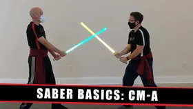
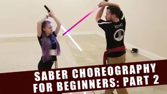
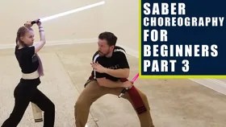
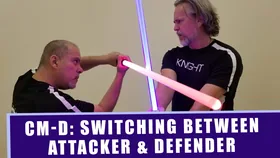
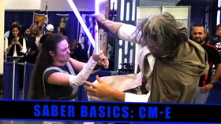

# Core Library

The Core Library is the official beginner foundation of the SaberCraft Standard: **CM-A through CM-E**. Every Saberist starts here. These five movements establish targeting, attack/parry pairing, role-switching, flow, and the basic vocabulary that every later movement — Extended or Community — builds on.

| Preview | Movement | Focus | Reference |
|---|---|---|---|
| { width="140" } | **[CM-A](cm-a.md)** | The 1st target points & the basic attack/parry relationship | Full written notation on this site |
| { width="140" } | **[CM-B](cm-b.md)** | Corners — shoulder and hip angle attacks | Full written notation on this site |
| { width="140" } | **CM-C** | Completes and complete-across sequences | [Part 1](https://sabercraft.org/lesson-3-cm-c-completes/) · [Part 2: Telegraphs](https://sabercraft.org/lesson-3-cm-c-completes-2/) · [Completes and Acrosses](https://sabercraft.org/cm-c-completes/) |
| { width="140" } | **CM-D** | Switching between attacker and defender roles | [Lesson](https://sabercraft.org/dynamic-combat/) · [Switching between Roles](https://sabercraft.org/cm-d-dynamic-combat/) |
| { width="140" } | **CM-E** | Special moves and counters | [Video lesson](https://sabercraft.org/cm-e-special-moves/) |

## What's next

Once CM-A through CM-E feel clean and repeatable at slow speed, move on to the [Extended Library](extended-library.md).
