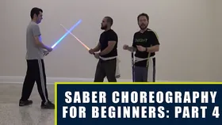

# Core Library

The Core Library is the official beginner foundation of the SaberCraft Standard: **CM-A through CM-E**. Every Saberist starts here. These five movements establish targeting, attack/parry pairing, role-switching, flow, and the basic vocabulary that every later movement — Extended or Community — builds on.

Work down the table in order. CM-C is taught in two parts: its completes must be understood before the full sequence can be performed.

CM-D is the threshold in this sequence, not simply the next item. Through CM-A to CM-C one Saberist attacks and the other defends from start to finish, so a student reads one active row and one answering it. From CM-D the attack changes hands mid-sequence and both rows are active — the point at which the notation starts describing a dialogue rather than a run of attacks. Expect it to take longer than the movements before it.

| Preview | Movement | Focus | Reference |
|---|---|---|---|
| { width="140" } | **[CM-A](cm-a.md)** | The 1st target points & the basic attack/parry relationship | Full written notation on this site |
| { width="140" } | **[CM-B](cm-b.md)** | Corners — shoulder and hip angle attacks | Full written notation on this site |
| { width="140" } | **[CM-C — Part 1](cm-c-part-1.md)** | Completes and complete-across — swings that carry through instead of stopping | Full written notation on this site |
| { width="140" } | **[CM-C — Part 2](cm-c-part-2.md)** | The full CM-C sequence, plus parry modifiers. Learn Part 1 first | Full written notation on this site |
| { width="140" } | **[CM-D](cm-d.md)** | Switching between attacker and defender roles | Full written notation on this site |
| { width="140" } | **[CM-E](cm-e.md)** | Special moves and counters | Full written notation on this site |

## What's next

Once CM-A through CM-E feel clean and repeatable at slow speed, move on to the [Extended Library](extended-library.md).
