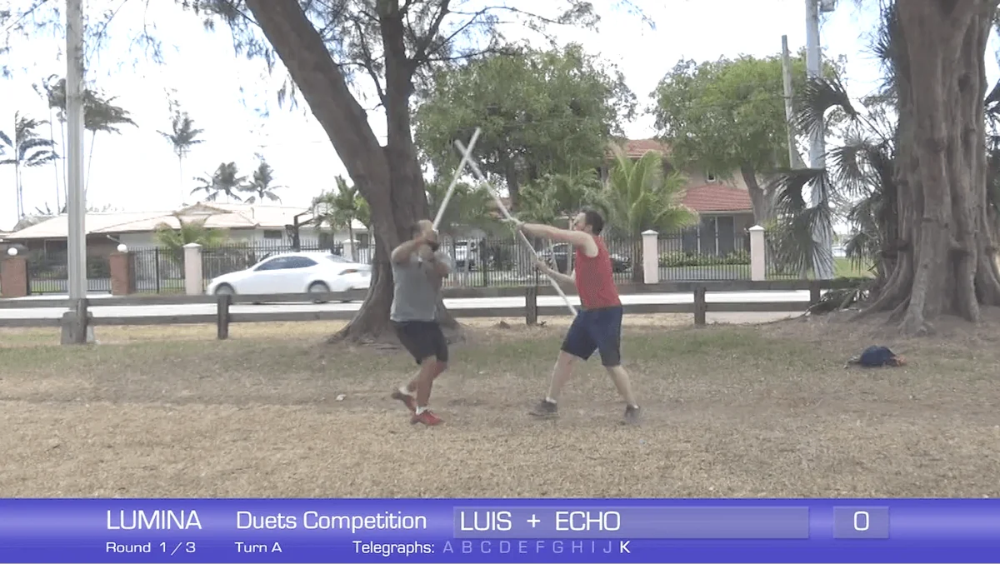
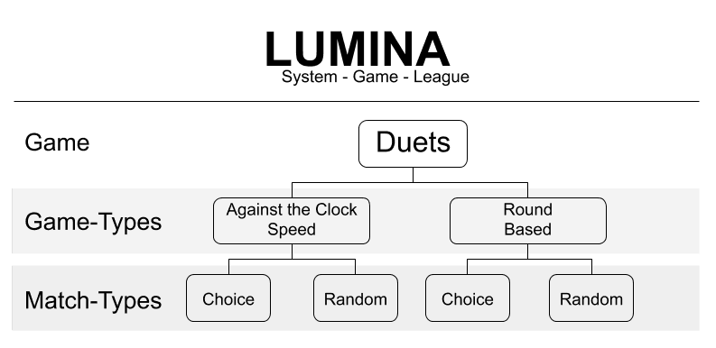

# Advanced Rules

These rules extend the base LUMINA Games format with the structures used on a full game day: how players are arranged, how a failing sequence can be recovered, how the Baseline and handicaps work, and the quick reference used during play.

For the core format, scoring values, and Power Play combinations, start with the [Games overview](index.md).

## Advanced play

  <iframe src="https://www.youtube.com/embed/fUA0MVjuEFQ" title="LUMINA advanced play" style="position:absolute;top:0;left:0;width:100%;height:100%;border:0;" allowfullscreen></iframe>

## Fundamentals play

  <iframe src="https://www.youtube.com/embed/SIEuQXWGlOo" title="LUMINA fundamentals play" style="position:absolute;top:0;left:0;width:100%;height:100%;border:0;" allowfullscreen></iframe>

## Arranging players for game day

Game days are usually split into two game types: **Against the Clock** and **Rounds-based**. Lumens competing are expected to enroll in one or both.

When you join a game type, you play twice, in two **match types**: once with a partner you choose, and once with a partner drawn at random.

For example, in Game 1:

- **Against the Clock.** Wilhelm chooses to play his first match with Valerie. The judges draw randomly from all players and pair Wilhelm with another Lumen at the game, Sarah. Wilhelm and Valerie finish their match with 25 points. Wilhelm plays again with Sarah and scores 20 points. Wilhelm keeps the higher of the two as his Speed score for Game 1: **25**.
- **Rounds-based.** Wilhelm again chooses Valerie for his first match. The judges pair him randomly with Charly. Wilhelm and Valerie finish with 23 points. Wilhelm plays again with Charly and scores 30 points. Wilhelm keeps the higher of the two as his Rounds score for Game 1: **30**.

We suggest running the day in this order, from easiest to most difficult:

1. Rounds — Chosen
2. Rounds — Random
3. Speed — Chosen
4. Speed — Random

Lumens are given the Random match type in both game types so they have a chance at an even better score by leaning on improvisation. In Chosen battles, partners have time to strategize; in Random ones they do not. This is where LUMINA combines what a Lumen knows of choreography with how they apply it under pressure.

A Lumen should battle once with their choice of partner for each game type, and may not play more than once for the same game type and match type.

## Recovery

**Recovery** is the act of saving a failing CM during the exchange.

If a partner loses their place or becomes confused, and their partner can get them back on track in fewer than two moves, the CM is recovered and counts for its full points, including Power Plays.

Getting a Duet back on track comes down to pace. Both partners should work together to pick up a possibly incomplete CM or Power Play by holding a consistent pace throughout that does not deviate. Three or more misses in a CM constitutes an **Incomplete**.

Example recoveries:

- The Lumens end up switching offensive and defensive roles, but both make the switch at the same time and complete the sequence on the opposite side. Assuming the pace stays consistent, this counts as a recovery.
- The Lumens switch roles mid-CM, but again both make the switch at the same time and complete the sequence. Assuming the pace stays consistent, this counts as a recovery.

## The Baseline

The champion plays a coaching role and becomes a judge in the following season. That role is titled the **Baseline**.

The Baseline's score is not tallied, but they may partner with active Lumens who are competing, giving those players the advantage of their proficiency. The Baseline fills empty spots in any game where an odd number of players is available. Their partner receives the points from the round; the Baseline does not.

If a Baseline opts not to judge 75% or more of the following season's matches, they are disqualified from participating in that season's games.

## Handicaps

A **handicap** offers an advantage or disadvantage to players. In any given game, a set of CMs may be worth more or fewer points than usual. This can shake things up, so that a CM normally worth many points may be worth less for one game.

For example, judges may agree that CM-N and CM-G are worth 5 points for an upcoming game, while CM-D and CM-E are worth 1 point. This encourages Lumens to learn as many CMs as possible so they are ready when handicaps come into play.

Handicaps should be communicated at least two weeks before the next game, and they apply to both formats.

## Adjudication awards

At the end of the season, the following awards are given.

| Award | Criteria |
|---|---|
| 1st place | The Lumen with the most points across the entire season |
| 2nd place | The Lumen with the second most points across the entire season |
| 3rd place | The Lumen with the third most points across the entire season |
| Vanguard | The Lumen with the highest average number of wins, having competed in at least half the games |

## Safety

Seek the advice of a physician before starting any exercise routine.

As in any sport, injuries can occur, and safety gear is always recommended, including padded gloves, eye protection, and proper athletic wear.

## Pocket quick reference

**The arena**

- Play must be conducted in a designated area or arena. A minimum of 30' × 30' is recommended.
- Players are discouraged from playing out of bounds. If players enter an out-of-bounds area, the turn is interrupted and they must return to the arena. If play continues out of bounds rather than returning, points for that turn are nullified and the Duet returns to the centre of the arena, with the defender beginning the next turn. The clock continues throughout.

**Matches and rounds**

- Matches and recoveries should be non-verbal. Lumens should not talk while playing.
- Each match is set either by time limit or by a predesignated number of rounds, based on the game type.
- Each round consists of turns between Lumens. Against the Clock has unlimited rounds; Rounds-based runs up to three rounds.
- A turn is where one participant engages the other using either one CM, or up to two CMs in a Power Play.
- Participants switch the attacker role after each turn.
- If the timer runs out mid-exchange, that turn does not count. If both Lumens were in the middle of a Power Play, it is invalidated no matter how far they got.

**Play**

- The attacker must telegraph the incoming CM or Power Play to the defender.
- Attackers must step forward. Defenders must step backward.
- Styled pauses and locks also count as steps.
- Lumens may **pass** a CM or Power Play by telegraph. Their teammate continues to offer telegraphs until the Lumen nods to engage.
- If the attacker forgets a strike, the CM is invalid and the turn switches to the defender, unless the team delivers a successful Recovery.
- Lumens may stop the match at any time by making the pass gesture at the judges and lowering their weapon.

**Points**

- CMs carry preassigned point values by category: Simple 1, Advanced 2, Extended 3, Super 4.
- The team is awarded points if attacker and defender successfully complete a CM.
- Points are awarded to the team, not to individual players.
- A **+10 bonus** is awarded for a match in which no CMs are repeated. Every CM in that match must be unique across both Lumens, so once one Lumen plays CM-B, neither may use it again.
- A striking participant incurs a penalty if their partner is injured. The worse the injury, the worse the penalty: a minimum of 1 point, up to disqualification.

**Pairing**

Lumens should be paired to succeed as well as they can. When selecting a chosen or random partner, options may be limited. If a Lumen wishes to play but knows only a few CMs, and other players do not want to team with them because it would limit their own seasonal scores, there are options:

- That Lumen may work with the Baseline, so more advanced players are unaffected.
- That Lumen may work with a more advanced Lumen, chosen or random, where the more advanced player forfeits their individual score and acts as the Baseline. The advanced Lumen keeps the score from their other match.

## Running two versions

In larger groups it helps to run two versions of the game, depending on player level.

| Version | Who it is for | How it runs |
|---|---|---|
| Fundamentals | Beginners | Uses a small number of CMs, with more lenient strike and defence rules |
| Advanced | Experienced Lumens | Opens up more or all of the CMs, with rules strictly enforced |
