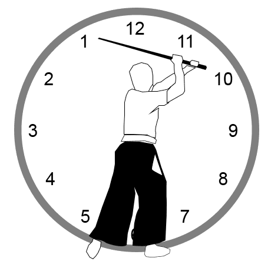

# Parries

A parry is a choreographed defensive response to an attack line.

In SaberCraft Notation, a parry is written as the target number plus the letter `P`.

!!! note "Plain-English version"
    If an attack is written as `1`, the matching parry is written as `1P`.

## Basic parry notation

A number followed by `P` is a parry.

| Symbol | Meaning |
|---|---|
| `1P` | Parry target 1 |
| `11P` | Parry target 11 |
| `3P` | Parry target 3 |
| `9P` | Parry target 9 |
| `5P` | Parry target 5 |
| `7P` | Parry target 7 |

The number tells the reader which target line is being received or answered.

The `P` tells the reader that the action is a parry, not an attack.

For the full twelve-line parry reference, use the [Notation Legend](legend.md).

## Parry versus block

In casual teaching, people may say "block."

In official SaberCraft Standard notation, use **parry** for the written `P` response.

| Term | Use |
|---|---|
| Parry | Preferred official notation term |
| Block | Informal teaching word; avoid as the main standard term |

This keeps the notation clear and consistent.

## Attack and parry relationship

Beginner notation uses matching attack/parry pairs.

| Attack | Matching parry |
|---|---|
| `1` | `1P` |
| `11` | `11P` |
| `3` | `3P` |
| `9` | `9P` |
| `5` | `5P` |
| `7` | `7P` |

The attack creates the line. The parry answers that line.

## Parries in a two-Saberist table

In a SaberCraft Standard table, the parry appears in the step column for the Saberist performing the defensive response.

| Player | Step 1 | Step 2 | Step 3 |
|---|---:|---:|---:|
| Saberist A | 1 | 11 | 3 |
| Saberist B | 1P | 11P | 3P |

Read this vertically:

- Step 1: Saberist A attacks `1`; Saberist B parries `1P`.
- Step 2: Saberist A attacks `11`; Saberist B parries `11P`.
- Step 3: Saberist A attacks `3`; Saberist B parries `3P`.

## Control standard

A SaberCraft Standard parry should be:

- ready
- controlled
- readable
- repeatable
- safe for both Saberists
- matched to the intended attack line

The purpose of the parry is not to win a fight. The purpose is to complete the shared choreographic phrase safely and clearly.

## Common beginner mistakes

| Mistake | Correction |
|---|---|
| Waiting too long to move | Start the parry as part of the shared timing |
| Swatting at the attack | Meet the line with control |
| Overpowering the partner | Reduce force and preserve choreography |
| Parrying the wrong line | Slow down and match the written target |
| Treating the parry like a real fight response | Keep it theatrical, repeatable, and safe |

## Parries in CM-A

CM-A uses six matching parries: `1P`, `11P`, `3P`, `9P`, `5P`, and `7P`.

For the full six-step CM-A table, use the [CM-A reference page](../core/cm-a.md).

Together, these teach the basic defensive response pattern for the six beginner target lines.

## Teaching note

When teaching parries, focus on recognition before speed.

A good beginner parry should answer three questions clearly:

1. Which attack line is being received?
2. Does the parry match the written notation?
3. Can both Saberists repeat the exchange safely?

If the answer is no, slow down and rebuild the step.

## Parry diagrams

<figure markdown>

<figcaption>Parry 1</figcaption>
</figure>

<figure markdown>

<figcaption>Parry 11</figcaption>
</figure>

<figure markdown>

<figcaption>Parry 3</figcaption>
</figure>

<figure markdown>

<figcaption>Parry 9</figcaption>
</figure>

<figure markdown>

<figcaption>Parry 5</figcaption>
</figure>

<figure markdown>

<figcaption>Parry 7</figcaption>
</figure>

## Related pages

- [Targets](targets.md)
- [Attacks](attacks.md)
- [Notation Examples](examples.md)
- [CM-A](../core/cm-a.md)
