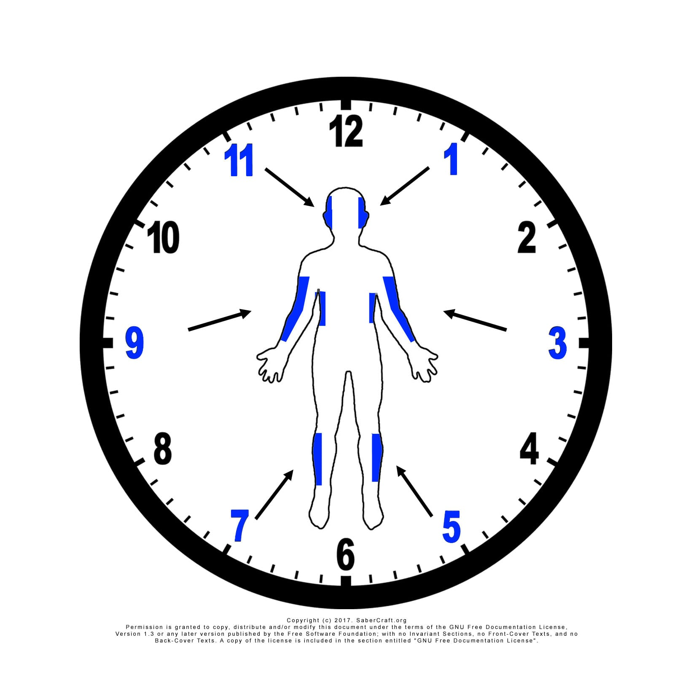
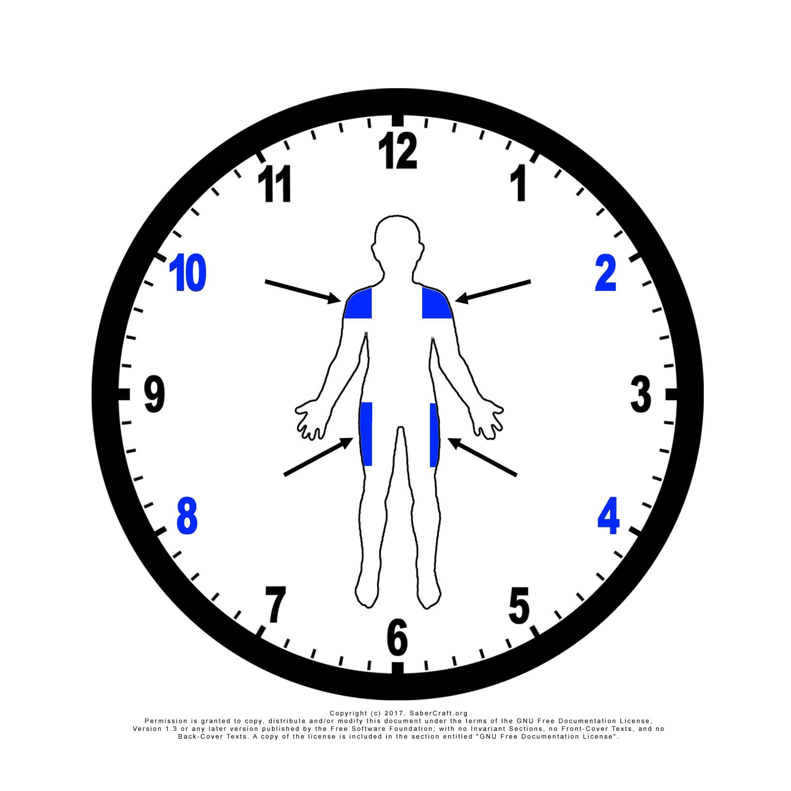
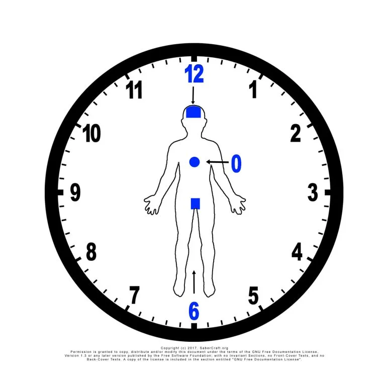

# Targets

Targets are the numbered lines used in SaberCraft Notation to describe where an attack is directed.

The SaberCraft Standard uses a clock-face model. Imagine a clock placed in front of your partner. The number in the notation points to the intended line of movement.

!!! note "Beginner idea"
    A target number does not mean "hit this body part." It means "move toward this choreographed line."

## The six beginner targets

The beginner target set uses six lines:

| Target | Beginner description | Common use |
|---:|---|---|
| `1` | High / upper center line | Opens the first vertical line of CM-A |
| `11` | High opposite line | Trains the opposite high response |
| `3` | Side line | Trains a horizontal side response |
| `9` | Opposite side line | Trains the opposite horizontal side response |
| `5` | Low line | Trains a lower diagonal or low-line response |
| `7` | Opposite low line | Trains the opposite low-line response |

These six targets are enough to read and practice **CM-A**, the first core movement. The full twelve-line notation reference is available in the [Notation Legend](legend.md).

## How to read a target

A plain number is an attack toward that target line.

| Symbol | Meaning |
|---|---|
| `1` | Attack target 1 |
| `11` | Attack target 11 |
| `3` | Attack target 3 |

A number followed by `P` is a parry against that target line.

| Symbol | Meaning |
|---|---|
| `1P` | Parry target 1 |
| `11P` | Parry target 11 |
| `3P` | Parry target 3 |

## Target perspective

Targets are read from the perspective of the choreographed exchange, not as random screen directions.

When learning, do not overthink camera angle, audience angle, or left/right naming. Start with the shared clock-face idea between the two Saberists.

The important questions are:

1. Which target line is being attacked?
2. Which parry receives that line?
3. Can both Saberists repeat the same movement safely?

## Targets in CM-A

CM-A uses all six beginner targets in sequence.

For the full six-step table, use the [CM-A reference page](../core/cm-a.md). This page only introduces the target concept so new readers are not asked to learn the whole sequence in multiple places.

This teaches the basic pattern:

> attack line → matching parry

## Control and distance

A target is not a license to strike.

In beginner practice:

- the attack should be controlled
- the defender should be ready
- the saber should stop before contact
- both Saberists should understand the line before adding speed

If a target line causes confusion or unsafe distance, slow down and reset.

## Target diagrams

<figure markdown>

<figcaption>The first six targets</figcaption>
</figure>

<figure markdown>

<figcaption>The second four targets</figcaption>
</figure>

<figure markdown>

<figcaption>The three deadly shots</figcaption>
</figure>

These three diagrams are migrated from the original SaberCraft target reference material. Still not yet created:

1. A CM-A target sequence diagram
2. A printable beginner target sheet

## Related pages

- [Attacks](attacks.md)
- [Parries](parries.md)
- [Notation Examples](examples.md)
- [CM-A](../core/cm-a.md)
