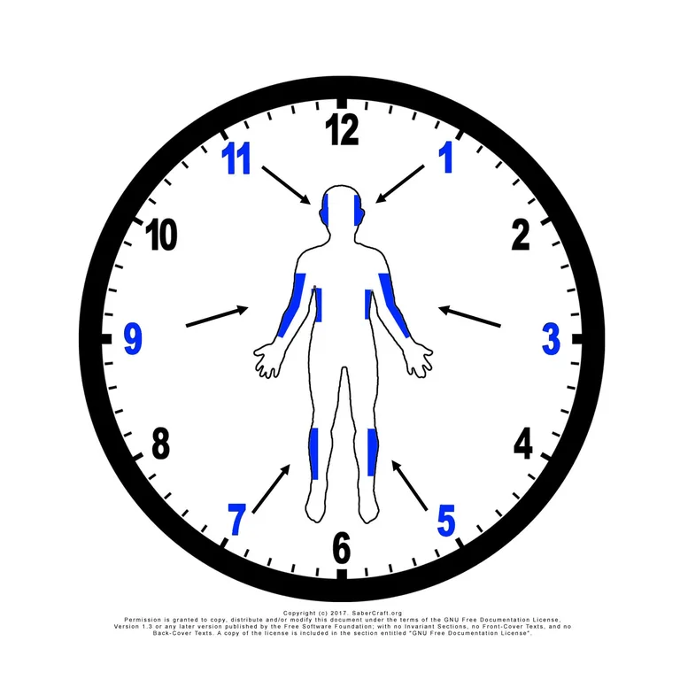
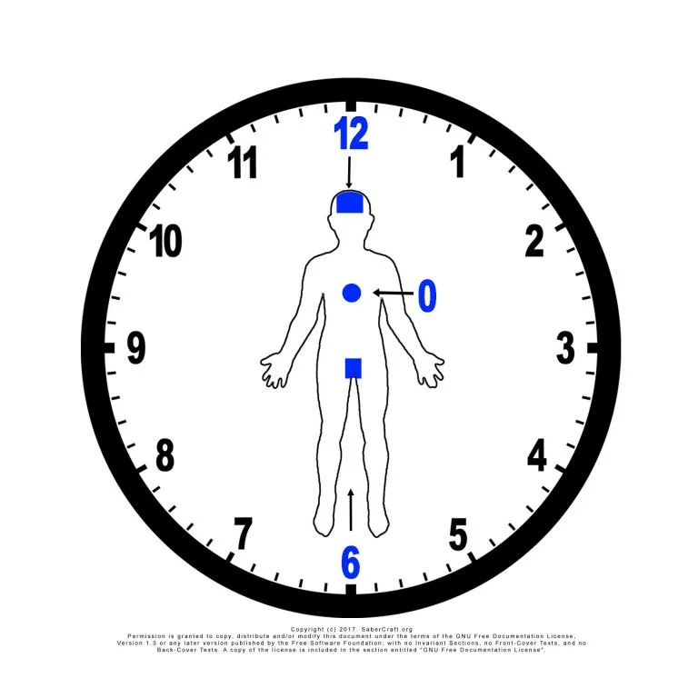

# Targets

Targets are the numbered lines used in Saber Standard Notation to describe where an attack is directed.

The Saber Standard uses a clock-face model. Imagine a clock placed in front of your partner. The number in the notation points to the intended line of movement.

!!! note "Beginner idea"
    A target number does not mean "hit this body part." It means "move toward this choreographed line."

## Target diagrams

| | | |
|:---:|:---:|:---:|
| [{ width="200" }](../assets/images/notation/targets-overview-1.webp){ .diagram-zoom target="_blank" rel="noopener" title="View the 1st six targets full size" } **The 1st six targets** | [{ width="200" }](../assets/images/notation/targets-overview-2.webp){ .diagram-zoom target="_blank" rel="noopener" title="View the 2nd four targets full size" } **The 2nd four targets** | [{ width="200" }](../assets/images/notation/targets-overview-3.webp){ .diagram-zoom target="_blank" rel="noopener" title="View the 3 deadly shots full size" } **The 3 deadly shots** |

Select any diagram to open it full size in a new tab.

## The six beginner targets

The beginner target set uses six lines:

| Target | Beginner description | Common use |
|---:|---|---|
| `1` | High / upper center line | Opens the first vertical line of CM-A |
| `11` | High opposite line | Trains the opposite high response |
| `3` | Side line | Trains a horizontal side response |
| `9` | Opposite side line | Trains the opposite horizontal side response |
| `5` | Low line | Trains a lower diagonal or low-line response |
| `7` | Opposite low line | Trains the opposite low-line response |

These six targets are enough to read and practice **CM-A**, the first core movement. The full twelve-line notation reference is available in the [Notation Legend](legend.md).

## How to read a target

A plain number is an attack toward that target line.

| Symbol | Meaning |
|---|---|
| `1` | Attack target 1 |
| `11` | Attack target 11 |
| `3` | Attack target 3 |

## Target perspective

Targets are named from the attacker's perspective: the clock face sits on the partner, and the number is read from the attacking side. They are not screen directions.

When learning, do not overthink camera angle, audience angle, or left/right naming. Start with the shared clock-face idea between the two Saberists.

The important questions are:

1. Which target line is being attacked?
2. Which parry receives that line?
3. Can both Saberists repeat the same movement safely?

## Control and distance

A target is not a license to strike.

In beginner practice:

- the attack should be controlled
- the defender should be ready
- the saber should stop before contact
- both Saberists should understand the line before adding speed

If a target line causes confusion or unsafe distance, slow down and reset.
